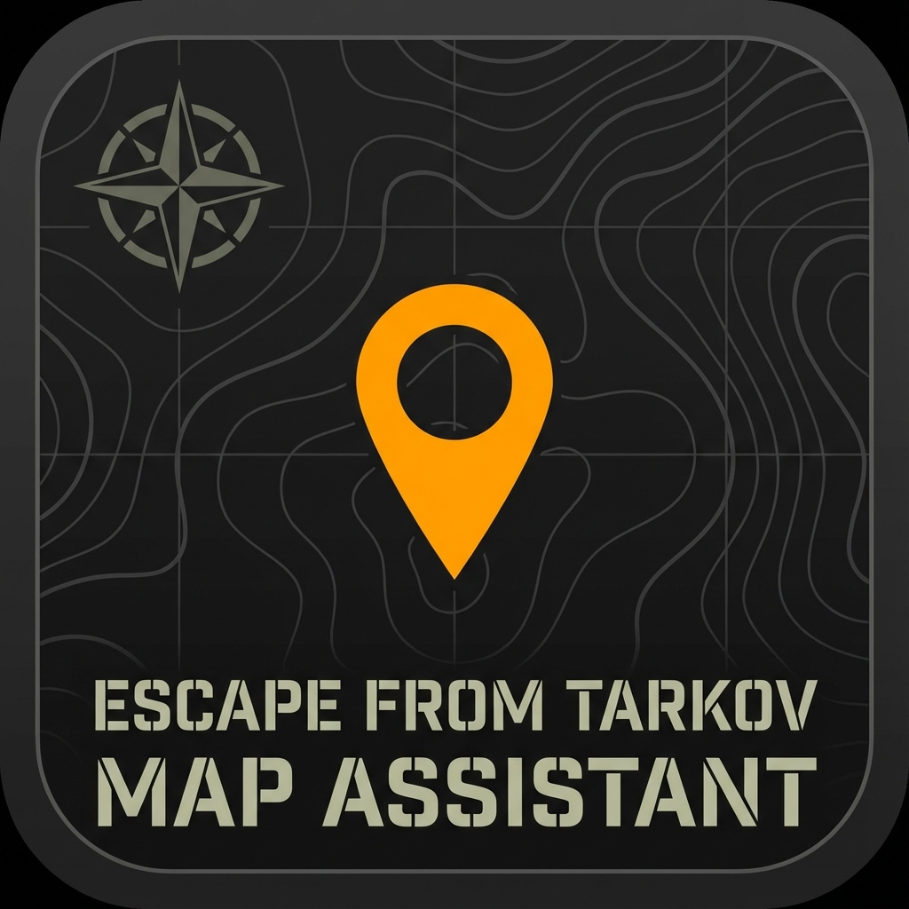

# Tarkov Interactive Map Assistant - Desktop Edition

<p align="center">
  
</p>

**English** | [中文](./README_ZH.md)

## 📖 Introduction

Escape from Tarkov Interactive Map Assistant Desktop Edition - A native desktop application built with Tauri + React for real-time interactive map assistance to help players navigate the game world.

**Version**: 1.1.6
**Author**: Tomy
**Original Project**: Based on [tarkov-tilty-frontend-opensource](https://github.com/tiltysola/tarkov-tilty-frontend-opensource)

---

## ✨ Features

- 🖥️ **Native Desktop App** - Built with Tauri, small installer (~5-10MB)
- 🗺️ **Real-time Interactive Map** - Smooth map display and interaction (including tile-based maps e.g. Labs)
- 📍 **Auto Coordinate Tracking** - Automatic player location tracking (requires setup)
- 🔄 **Auto Map Switching** - Smart map switching based on game state (Rust-backed game log watching in desktop)
- 🎯 **Location Markers** - Mark important locations and loot spots
- 📊 **Coordinate Calculation** - Real-time coordinate and direction display
- 🎨 **Tarkov Theme** - Military tactical UI design
- ⚡ **High Performance** - Rust backend for native performance
- 🔒 **Offline Usage** - Works without internet connection
- 📌 **System Tray** - Minimize to tray, show/hide with menu or click
- ⌨️ **Global Hotkey** - Press **M key** to toggle Picture-in-Picture mode even when window is unfocused

---

## 🛠️ Tech Stack

### Frontend
- **React** 18.2 - UI framework
- **TypeScript** 5.1 - Type safety
- **Vite** 4.4 - Build tool
- **React Konva** - Canvas rendering
- **Recoil** - State management
- **React Router** - Navigation

### Backend
- **Rust** - Native performance
- **Tauri** 2.0 - Desktop framework
- **WebView2** - Windows rendering engine
- **rdev** 0.5 - Global keyboard event listener

### UI Components
- Ant Design Icons
- React Toastify
- RC Slider

---

## 📦 Installation & Usage

### Prerequisites

Make sure you have the following installed:
- [Node.js](https://nodejs.org/) (v18+ recommended)
- [Rust](https://www.rust-lang.org/) (latest stable)
- [WebView2](https://developer.microsoft.com/microsoft-edge/webview2/) (usually pre-installed on Windows 10/11)

### Install Dependencies

```bash
npm install --legacy-peer-deps
```

> **Note**: The `--legacy-peer-deps` flag is required to resolve peer dependency conflicts.

### Development Mode

Run development server (with hot reload)

```bash
npm run tauri dev
```

### Production Build

Build production installer

**Method 1: Build with TypeScript check (recommended)**

```bash
npm run build              # Build frontend
npm run tauri build        # Build Tauri app and create installer
```

**Method 2: Skip TypeScript check (if encountering type errors)**

```bash
npx vite build             # Build frontend (skip TypeScript)
npm run tauri build        # Build Tauri app and create installer
```

**Build Output Location**:

```
src-tauri/target/release/bundle/
├── nsis/
│   └── *_x64-setup.exe     # NSIS installer
└── msi/
    └── *.msi                # Windows Installer package
```

> **Note**: The build process may take several minutes, especially for the first build.

---

## 🎨 Custom Icon

To customize the app icon, prepare a 1240x1240 PNG image:

```bash
# 1. Place your icon as app-icon.png in the project root
# 2. Run the icon generation tool
npm run tauri icon
```

---

## 🔧 Development Notes

### Project Structure

```
tarkov-interactive-map-assistant-desktop/
├── src/                    # Frontend code
│   ├── pages/             # Page components
│   ├── components/        # Common components
│   ├── assets/            # Static assets
│   └── utils/             # Utility functions
├── src-tauri/             # Backend code
│   ├── src/
│   │   ├── main.rs       # Entry point
│   │   └── lib.rs        # Core logic
│   ├── icons/            # App icons
│   └── tauri.conf.json   # Tauri config
├── index.html            # HTML entry
├── vite.config.ts        # Vite config
└── package.json          # Dependencies
```

### Available Scripts

```bash
# Development
npm run dev              # Vite dev server
npm run tauri dev        # Tauri dev mode

# Build
npm run build            # Build frontend
npm run tauri build      # Build desktop app

# Code Quality
npm run lint             # Run ESLint
npm run lint:fix         # Fix ESLint issues
npm run prettier         # Format code
npm run fix              # Fix all issues

# Tools
npm run tauri icon       # Generate app icons
```

### Tauri Commands

Available Rust backend commands

```rust
// File system
read_text_file(path: String) -> Result<String, String>
read_directory(path: String) -> Result<Vec<String>, String>
path_exists(path: String) -> bool

// Screenshot directory (for coordinate tracking)
set_screenshot_path(path: String) -> Result<String, String>
get_screenshot_path() -> String

// Tarkov game directory (game log watching, profile/raid events)
set_tarkov_game_path(path: String) -> Result<String, String>
get_tarkov_game_path() -> String
```

---

## 🚀 Performance

- ✅ Resource optimization: 99.5% size reduction (12MB → 60KB)
- ✅ Rust backend: Native performance, low memory usage
- ✅ Canvas rendering: Efficient map rendering with Konva
- ✅ Loading optimization: Blue-themed loading screen

---

## 🎯 Feature Enhancements

### Implemented
- ✅ Disable DevTools (F12)
- ✅ Custom App Icon (Tarkov themed)
- ✅ Loading Animation (Blue theme)
- ✅ Window starts maximized
- ✅ System Tray Support
  - Tray icon (uses app icon)
  - Context Menu: Show Window / Hide Window / Quit
  - Left click to toggle visibility
  - Close button hides to tray
- ✅ File System Access API
- ✅ Single Instance Lock (Prevents multiple instances)
- ✅ Global Keyboard Listener (M key toggles Picture-in-Picture)
- ✅ Rust Game Log Watcher (desktop: pick game dir via dialog, backend parses application log and emits profile/raid events)
- ✅ Tile Map Support (Labs / The Lab map loads via tile layer)
- ✅ Extract Name Localization (PMC/Scav extract Chinese names from reference data)

### Known Issues
- None
  
### Planned
- ⏸️ Game Process Monitoring
- ⏸️ Auto-start Option
- ⏸️ Multi-language Support

---

## 📝 License

This project is open source under the **GPL v3 License**.

---

## 🙏 Credits

Special thanks to [@tiltysola](https://github.com/tiltysola) for creating the [original project](https://github.com/tiltysola/tarkov-tilty-frontend-opensource). This desktop version is adapted from that work.

---

## 📮 Contact & Support

- **Issues**: GitHub Issues
- **Discussions**: GitHub Discussions
- **Original Project**: [tarkov-interactive-map-assistant-web](https://github.com/TomyTang331/tarkov-interactive-map-assistant)

---

## 📊 Changelog

See [CHANGELOG.md](./CHANGELOG.md) for detailed release history.

### Version 1.1.6 (2026-03-11)

- ✨ **New Feature**: The Lab (实验室) map now loads correctly
  - Implemented tile-based map support: `TileLayer` component loads and renders map tiles
  - Virtual canvas size for coordinate conversion when no SVG base image exists
  - Labs uses `tilePath` only; rendering and markers now work as expected
- ✨ **New Feature**: Rust-backed game log watching
  - In desktop app, "Select Tarkov game directory" uses Tauri dialog; path is stored in Rust
  - Backend resolves `Logs` → latest `log_*` → application log file and watches it in a background thread
  - Parses profile and raid lines, emits `profile-log` and `raid-log` events to frontend
  - Frontend listens for events and updates raid info / auto map switch without polling
  - Screenshot directory watching and all other behavior unchanged
- ✨ **New Feature**: PMC/Scav extract Chinese names
  - Added `extract_names_zh.json` and `getExtractDisplayName()`; extract labels use reference Chinese names
- 🧹 **Code quality**: ESLint fixes (max-len, no-nested-ternary, no-empty) in Canvas, BaseMap, MapInfo, index

### Version 1.1.5 (2025-12-19)

- ✨ **New Feature**: Automatic PNG cleanup on exit
  - Selected screenshot directory's PNG files are automatically deleted when the application exits
  - Triggered when quitting via system tray "Quit" menu
  - Silent operation with no user prompts
  - Helps keep screenshot folder clean automatically

### Version 1.1.4 (2025-12-19)

- ✨ **New Feature**: Global keyboard hotkey support
  - Press **M key** anytime to toggle Picture-in-Picture mode, even when the application window is unfocused
  - Implemented using `rdev` library for system-wide keyboard event listening
  - Provides seamless control while playing the game in fullscreen

### Version 1.1.3 (2025-12-19)

- 🐛 **Fixed**: Marker zoom functionality (标点缩放) now works correctly
  - Uncommented the `onPlayerLocationChange` callback in PlayerLocation component
  - Optimized zoom logic in Canvas component
  - When enabled, map now properly zooms to 3x base scale and centers on player location
- 🧹 **Optimization**: Significant code cleanup and refactoring
  - Removed unused `AdditionFunc` component and redundant social links
  - Removed deprecated `parseFleaMarketInfo` logic and dead code
  - Optimized File System Access API type definitions
  - Fixed various ESLint warnings and improved code quality

### Version 1.1.2 (2025-12-18)

- 🐛 Fixed all React console key prop warnings (11 components)
- 🐛 Fixed Picture-in-Picture blank window issue
- 🐛 Fixed canvas infinite loop warning
- 🔒 Blocked all reload shortcuts (prevents accidental refresh)
- ⚡ Performance improvements

### Version 1.1.0 (2025-12-17)

- ✨ First desktop release
- ✨ Rebuilt with Tauri, installer only 5-10MB
- ✨ Blue theme UI design
- ✨ Optimized loading experience
- ✨ Custom Tarkov-themed icon
- ✨ System tray support (show/hide/quit)
- ✨ Window starts maximized by default
- ✨ Close button hides to tray instead of exit

---

## 🐛 Troubleshooting

**Issue**: `npm install` fails with dependency conflict errors

**Solution**: Use the `--legacy-peer-deps` flag
```bash
npm install --legacy-peer-deps
```
This resolves peer dependency conflicts that may occur with some packages.

---

---

<p align="center">
  Made with ❤️ for Escape from Tarkov players
</p>
